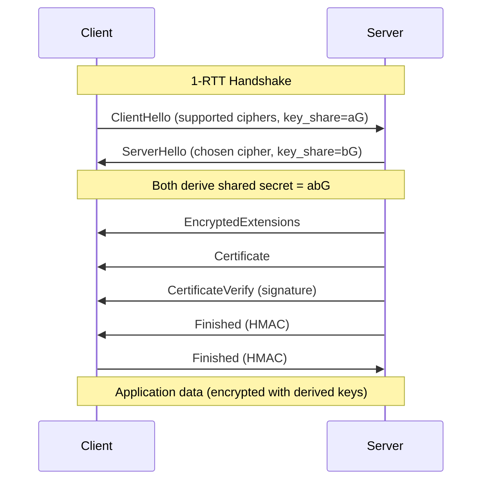
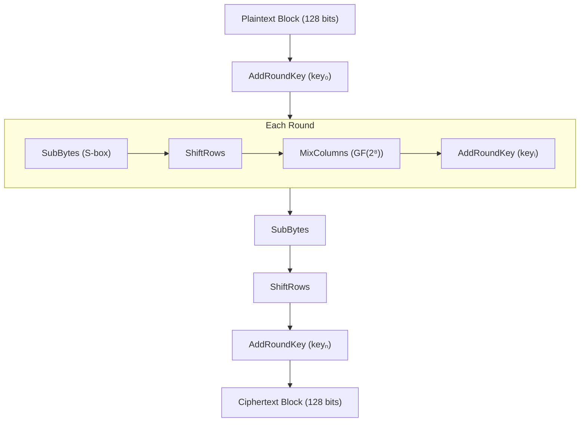
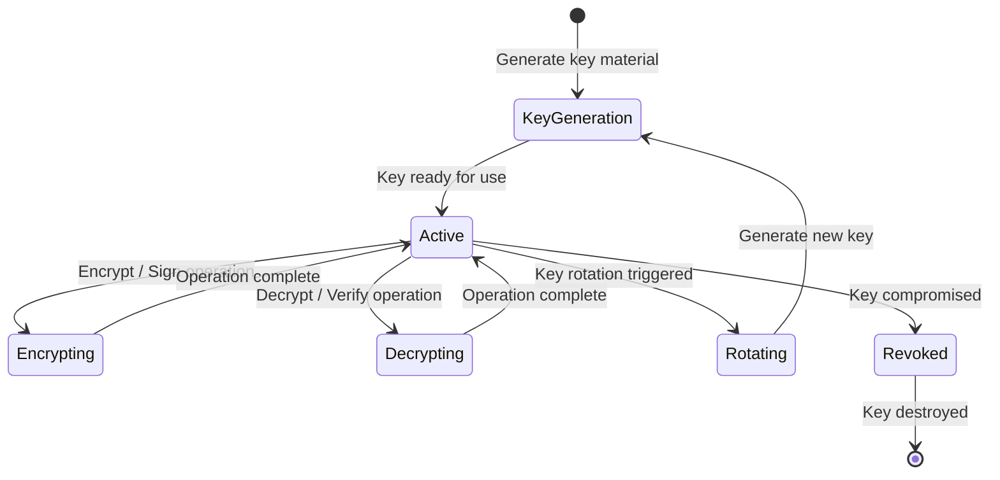

# Crypto Primitives

A from-scratch implementation of core cryptographic primitives: AES symmetric encryption, SHA-256 hashing, RSA and ECDSA asymmetric cryptography, and a TLS 1.3 handshake simulator. Built for educational purposes to understand the mathematics behind modern cryptography — not for production use.

## Theory & Background

### Why Cryptography Matters

Every time you load a webpage, send a message, or tap your credit card, cryptographic primitives are working behind the scenes. Symmetric ciphers protect data at rest, hash functions verify integrity, asymmetric algorithms enable trust between strangers, and protocols like TLS tie it all together into secure channels. Understanding these primitives from the math up reveals why they work — and what breaks when they're misused.

### Symmetric Encryption: AES

The Advanced Encryption Standard (AES) is a substitution-permutation network that encrypts 128-bit blocks using 128, 192, or 256-bit keys. The core idea is simple: alternate between confusion (making the relationship between key and ciphertext complex) and diffusion (spreading each plaintext bit's influence across the entire block). Each round applies four transformations:

1. **SubBytes**: Non-linear byte substitution using the S-box, derived from the multiplicative inverse in $\text{GF}(2^8)$
2. **ShiftRows**: Cyclic left shift of each row by its row index
3. **MixColumns**: Matrix multiplication over $\text{GF}(2^8)$ for diffusion
4. **AddRoundKey**: XOR with the round key

The MixColumns step multiplies each column by a fixed matrix over the Galois field $\text{GF}(2^8)$ with irreducible polynomial $x^8 + x^4 + x^3 + x + 1$:

```math
\begin{bmatrix} b_0 \\ b_1 \\ b_2 \\ b_3 \end{bmatrix} = \begin{bmatrix} 2 & 3 & 1 & 1 \\ 1 & 2 & 3 & 1 \\ 1 & 1 & 2 & 3 \\ 3 & 1 & 1 & 2 \end{bmatrix} \begin{bmatrix} a_0 \\ a_1 \\ a_2 \\ a_3 \end{bmatrix} \pmod{x^8 + x^4 + x^3 + x + 1}
```

AES-128 uses 10 rounds, AES-192 uses 12, and AES-256 uses 14. The key schedule expands the cipher key into round keys using RotWord, SubWord, and XOR with round constants.

**Block cipher modes** determine how to encrypt messages longer than one block:

- **ECB**: Each block encrypted independently (insecure — reveals patterns)
- **CBC**: Each plaintext block XORed with previous ciphertext block before encryption
- **CTR**: Encrypts a counter to produce a keystream (parallelizable, no padding needed)
- **GCM**: CTR mode + GHASH authentication tag for authenticated encryption

### Cryptographic Hashing: SHA-256

A hash function takes arbitrary-length input and produces a fixed-length digest. A good cryptographic hash is a one-way function: easy to compute, infeasible to reverse, and any small change in input produces a completely different output (the avalanche effect).

SHA-256 produces a 256-bit digest. The message is padded to a multiple of 512 bits, then processed in 512-bit blocks. Each block goes through 64 rounds of compression using four mixing functions:

```math
\begin{aligned}
\Sigma_0(a) &= \text{ROTR}^2(a) \oplus \text{ROTR}^{13}(a) \oplus \text{ROTR}^{22}(a) \\
\Sigma_1(e) &= \text{ROTR}^6(e) \oplus \text{ROTR}^{11}(e) \oplus \text{ROTR}^{25}(e) \\
\text{Ch}(e, f, g) &= (e \wedge f) \oplus (\neg e \wedge g) \\
\text{Maj}(a, b, c) &= (a \wedge b) \oplus (a \wedge c) \oplus (b \wedge c)
\end{aligned}
```

Each round updates eight working variables ($a$ through $h$):

```math
\begin{aligned}
T_1 &= h + \Sigma_1(e) + \text{Ch}(e, f, g) + K_t + W_t \\
T_2 &= \Sigma_0(a) + \text{Maj}(a, b, c) \\
h &\leftarrow g, \quad g \leftarrow f, \quad f \leftarrow e, \quad e \leftarrow d + T_1 \\
d &\leftarrow c, \quad c \leftarrow b, \quad b \leftarrow a, \quad a \leftarrow T_1 + T_2
\end{aligned}
```

where $K_t$ are round constants (first 32 bits of the fractional parts of the cube roots of the first 64 primes) and $W_t$ is the message schedule.

**HMAC** (Hash-based Message Authentication Code) uses SHA-256 with a secret key to provide both integrity and authentication:

```math
\text{HMAC}(K, m) = H\bigl((K' \oplus \text{opad}) \| H((K' \oplus \text{ipad}) \| m)\bigr)
```

where $K'$ is the key padded to the block size, and $\text{opad}$, $\text{ipad}$ are fixed padding constants.

### RSA

RSA security relies on a simple asymmetry: multiplying two large primes is easy, but factoring their product is computationally infeasible. This one-way trapdoor enables public-key cryptography.

Key generation:
1. Choose large primes $p$, $q$ and compute $n = pq$
2. Compute Euler's totient: $\varphi(n) = (p-1)(q-1)$
3. Choose public exponent $e$ (typically 65537) coprime to $\varphi(n)$
4. Compute private exponent $d = e^{-1} \bmod \varphi(n)$

Encryption and decryption are modular exponentiation:

```math
c = m^e \bmod n \quad \text{(encrypt)}, \qquad m = c^d \bmod n \quad \text{(decrypt)}
```

This works because of Euler's theorem — raising $m$ to the $ed$-th power modulo $n$ returns $m$:

```math
m^{ed} \equiv m^{1 + k\varphi(n)} \equiv m \cdot (m^{\varphi(n)})^k \equiv m \pmod{n}
```

RSA signing uses the private key: signature $s = H(m)^d \bmod n$, verified by checking $H(m) \equiv s^e \bmod n$.

**OAEP padding** (Optimal Asymmetric Encryption Padding) prevents chosen-ciphertext attacks by adding randomness before encryption.

### ECDSA

Elliptic Curve Digital Signature Algorithm operates on points of an elliptic curve over a finite field. The security comes from the discrete logarithm problem on curves: given points $P$ and $Q = kP$, finding the scalar $k$ is computationally infeasible for large curves — even though computing $kP$ from $k$ and $P$ is efficient.

The curve secp256k1 (used in Bitcoin) is defined by:

```math
y^2 = x^3 + 7 \pmod{p}, \quad p = 2^{256} - 2^{32} - 977
```

Point addition on the curve: given points $P = (x_1, y_1)$ and $Q = (x_2, y_2)$, the sum $R = P + Q$ has coordinates:

```math
\lambda = \frac{y_2 - y_1}{x_2 - x_1} \bmod p, \quad x_3 = \lambda^2 - x_1 - x_2 \bmod p, \quad y_3 = \lambda(x_1 - x_3) - y_1 \bmod p
```

For point doubling ($P = Q$):

```math
\lambda = \frac{3x_1^2 + a}{2y_1} \bmod p
```

Scalar multiplication $kP$ is computed via the double-and-add algorithm in $O(\log k)$ group operations.

**ECDSA signing** (with private key $d$, generator $G$ of order $n$):
1. Choose random $k \in [1, n-1]$
2. Compute $R = kG$, let $r = x_R \bmod n$
3. Compute $s = k^{-1}(H(m) + r \cdot d) \bmod n$
4. Signature is $(r, s)$

**Verification** (with public key $Q = dG$):

```math
u_1 = s^{-1} H(m) \bmod n, \quad u_2 = s^{-1} r \bmod n, \quad R' = u_1 G + u_2 Q
```

Accept if $x_{R'} \equiv r \pmod{n}$.

### Tradeoffs and Alternatives

| Primitive | This Implementation | Alternative | Tradeoff |
|-----------|-------------------|-------------|----------|
| **Symmetric cipher** | AES (128/192/256-bit) | ChaCha20 | AES has hardware acceleration (AES-NI) on most CPUs; ChaCha20 is faster in software without hardware support |
| **Hash function** | SHA-256 | SHA-3 (Keccak), BLAKE3 | SHA-256 is ubiquitous and well-analyzed; SHA-3 has a different construction (sponge) providing diversity; BLAKE3 is faster |
| **Asymmetric encryption** | RSA-2048+ | ECIES (elliptic curve) | RSA keys are large (2048+ bits) but the math is simpler; ECC achieves equivalent security with 256-bit keys |
| **Digital signature** | ECDSA (secp256k1) | EdDSA (Ed25519) | ECDSA requires a random nonce (nonce reuse is catastrophic); EdDSA is deterministic and harder to misuse |
| **Key exchange** | ECDHE | X25519, Kyber (post-quantum) | ECDHE is standard in TLS 1.3; Kyber provides quantum resistance but is newer and less battle-tested |

The choice between RSA and ECC is the most consequential: RSA-2048 provides ~112 bits of security with 2048-bit keys, while ECDSA on secp256k1 provides ~128 bits with 256-bit keys. ECC wins on key size and performance, but RSA's simpler math makes it easier to audit.

### TLS 1.3 Handshake

TLS 1.3 ties all the primitives together into a secure channel. It establishes encryption in a single round trip (1-RTT) using Ephemeral Elliptic Curve Diffie-Hellman (ECDHE) for key exchange:

```math
\text{Shared Secret} = a \cdot (bG) = b \cdot (aG) = abG
```

where $a$ and $b$ are the client and server's ephemeral private keys, and $G$ is the curve generator. Neither party reveals their private key, yet both derive the same shared secret.

The key derivation uses HKDF (HMAC-based Key Derivation Function):

```math
\text{PRK} = \text{HKDF-Extract}(\text{salt}, \text{IKM}), \quad \text{OKM} = \text{HKDF-Expand}(\text{PRK}, \text{info}, L)
```

### TLS 1.3 Handshake Flow



### AES Round Structure



### Cryptographic Primitive Lifecycle

Each primitive has a well-defined lifecycle from key generation through use to eventual rotation:



### TLS Key Derivation Timeline

The TLS 1.3 key schedule derives multiple keys in sequence from the shared ECDHE secret:

```mermaid
gantt
    title TLS 1.3 Key Derivation Schedule
    dateFormat X
    axisFormat %s

    section Key Exchange
        ECDHE shared secret derivation    :0, 2
        Early secret (PSK or 0)           :0, 1

    section Handshake Keys
        Handshake secret (HKDF-Extract)   :2, 3
        Client handshake traffic key      :3, 4
        Server handshake traffic key      :3, 4

    section Application Keys
        Master secret (HKDF-Extract)      :4, 5
        Client application traffic key    :5, 6
        Server application traffic key    :5, 6

    section Resumption
        Resumption master secret          :6, 7
        Session ticket encryption         :7, 8
```



### Key References

- NIST, "Advanced Encryption Standard (AES)" FIPS 197 (2001) — [NIST](https://doi.org/10.6028/NIST.FIPS.197-upd1)
- NIST, "Secure Hash Standard (SHS)" FIPS 180-4 (2015) — [NIST](https://doi.org/10.6028/NIST.FIPS.180-4)
- Rivest, Shamir & Adleman, "A Method for Obtaining Digital Signatures and Public-Key Cryptosystems" (1978) — [CACM](https://doi.org/10.1145/359340.359342)
- Johnson, Menezes & Vanstone, "The Elliptic Curve Digital Signature Algorithm (ECDSA)" (2001) — [IJIS](https://doi.org/10.1007/s102070100002)
- Rescorla, "The Transport Layer Security (TLS) Protocol Version 1.3" RFC 8446 (2018) — [IETF](https://datatracker.ietf.org/doc/html/rfc8446)

## Real-World Applications

Cryptographic primitives are the invisible infrastructure of digital trust. Every secure transaction, private message, and authenticated login depends on the algorithms implemented here. Understanding them from the ground up is essential for anyone building systems where security is non-negotiable.

| Industry | Use Case | Impact |
|----------|----------|--------|
| **Fintech** | Securing payment card transactions with AES encryption and RSA/ECDSA signatures for authorization | Protects billions of daily transactions; a single cryptographic flaw can expose millions of accounts |
| **Healthcare** | Encrypting patient records (HIPAA compliance) and signing medical documents with digital certificates | Ensures patient data confidentiality while enabling secure sharing between providers and insurers |
| **IoT** | Authenticating firmware updates and securing device-to-cloud communication with TLS and ECDSA | Prevents unauthorized control of connected devices — from smart locks to industrial sensors |
| **Cloud infrastructure** | Encrypting data at rest (AES-256-GCM) and in transit (TLS 1.3) across distributed storage systems | Meets compliance requirements (SOC 2, FedRAMP) while maintaining performance at scale |
| **Government** | Securing classified communications with validated cryptographic modules (FIPS 140-3 compliance) | Provides mathematically grounded assurance that adversaries cannot intercept or forge sensitive communications |

## Project Structure

```
crypto-primitives/
├── src/
│   ├── __init__.py
│   ├── symmetric/
│   │   ├── __init__.py
│   │   ├── aes_core.py            # AES round functions (SubBytes, ShiftRows, MixColumns)
│   │   ├── key_schedule.py        # AES key expansion (128/192/256-bit)
│   │   ├── modes.py               # ECB, CBC, CTR, GCM block cipher modes
│   │   └── galois.py              # GF(2⁸) arithmetic for MixColumns and GCM
│   ├── hashing/
│   │   ├── __init__.py
│   │   ├── sha256.py              # SHA-256 compression and padding
│   │   ├── hmac.py                # HMAC-SHA256 construction
│   │   └── merkle.py              # Merkle tree for data integrity verification
│   ├── asymmetric/
│   │   ├── __init__.py
│   │   ├── rsa.py                 # RSA key generation, encrypt/decrypt, sign/verify
│   │   ├── primes.py              # Miller-Rabin primality testing, prime generation
│   │   ├── ecdsa.py               # ECDSA on secp256k1 (sign, verify)
│   │   ├── elliptic_curve.py      # Point addition, doubling, scalar multiplication
│   │   └── oaep.py                # OAEP padding for RSA encryption
│   └── tls/
│       ├── __init__.py
│       ├── handshake.py           # TLS 1.3 handshake state machine
│       ├── key_exchange.py        # ECDHE key agreement
│       ├── hkdf.py                # HKDF-Extract and HKDF-Expand (RFC 5869)
│       └── record.py              # TLS record layer encryption/decryption
├── requirements.txt
├── .gitignore
└── README.md
```

## Quick Start

```bash
pip install -r requirements.txt

# Encrypt and decrypt with AES-256-CBC
python -m src.symmetric.modes --mode cbc --key-size 256 --plaintext "Hello, World!"

# Compute SHA-256 hash of a file
python -m src.hashing.sha256 --input data/sample.txt

# Generate RSA key pair and sign a message
python -m src.asymmetric.rsa --generate --bits 2048
python -m src.asymmetric.rsa --sign --message "Sign this" --key private.pem

# Run TLS 1.3 handshake simulation between client and server
python -m src.tls.handshake --simulate --cipher TLS_AES_256_GCM_SHA384
```

## Implementation Details

### What makes this non-trivial

- **Constant-time S-box**: A naive lookup-table S-box is vulnerable to cache-timing side channels. The implementation computes the S-box using algebraic operations in $\text{GF}(2^8)$ — multiplicative inverse via Fermat's little theorem ($a^{-1} = a^{254}$) followed by an affine transform — avoiding data-dependent memory access patterns.
- **GF(2⁸) arithmetic without lookup tables**: MixColumns and GCM's GHASH require multiplication in $\text{GF}(2^8)$. The implementation uses the "Russian peasant" (double-and-add) algorithm with reduction by the AES polynomial, operating in constant time regardless of operand values.
- **Miller-Rabin with deterministic witnesses**: For RSA key generation, the primality test uses deterministic witness sets for numbers below $3.3 \times 10^{24}$ (covering all practical key sizes), guaranteeing correctness rather than probabilistic confidence. For larger numbers, it falls back to 40 random witnesses for a failure probability below $4^{-40}$.
- **Montgomery ladder for scalar multiplication**: The naive double-and-add algorithm for elliptic curve scalar multiplication leaks the scalar through timing. The Montgomery ladder performs the same sequence of operations regardless of the scalar bits, providing constant-time execution that resists simple power analysis.
- **TLS 1.3 key schedule**: The full TLS 1.3 key derivation is a complex tree of HKDF-Extract and HKDF-Expand-Label calls that produces separate keys for handshake traffic, application traffic, and resumption. The implementation follows RFC 8446 Section 7.1 exactly, deriving client/server handshake keys, finished keys, and application traffic keys from the shared ECDHE secret and transcript hash.
